# Azure Logic App
Azure Logic App은 코드가 거의 없는(Low Code) 또는 전혀 없는 (No Code) 자동화된 워크플로를 만들고 실행 할 수 있는 클라우드 플랫폼입니다.


<!-- # 목차
-  -->

# Azure 주요 통합 도구


| 제품 | 기능 |
| --- | --- | 
| [Logic Apps](https://azure.microsoft.com/ko-kr/services/logic-apps/) | 클라우드 및 온-프레미스에서 수백 개의 서비스를 연결하기 위해 워크플로 만들기 및 비즈니스 프로세스 오케스트레이션 | 
| [Azure Functions](https://azure.microsoft.com/ko-kr/services/functions/) | 이벤트 기반 서버리스 컴퓨팅 플랫폼을 사용하여 복잡한 오케스트레이션 문제 간소화, 간결한 코드로 트리거 및 바인딩 정의
| [Event Grid](https://azure.microsoft.com/ko-kr/services/event-grid/) | 완전 관리형 이벤트 라우팅 서비스를 사용하여 [지원되는 리소스](https://learn.microsoft.com/ko-kr/azure/event-grid/system-topics)를 이벤트 기반의 게시-구독 모델로 제공 |

기타 Service Bus, API Management, Azure Data Factory 가 있음.

# Logic Apps의 호스팅 옵션
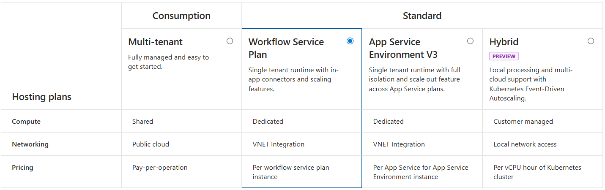
Consumption 과 Standard 타입으로 구분되며 Consumption 은 Public Cloud 전용이고, 다중 테넌트 지원 가능.
Workflow Service 는 공용으로 사용되는 환경에서 워크플로를 할당하여 합리적 가격으로 사용 가능, App Service Environment 는 격리된 VM 이 할당.

# 빌딩 블록
로지앱을 통해 빌드되는 워크플로의 구성요소로써 크게 3가지 요소(트리거, 액션, 설정)가 사용됨.

## 1. Triggers(트리거)
모든 워크플로에는 워크플로를 인스턴스화하고 시작하는 호출을 정의하는 트리거가 포함됨.

### 기본 제공 트리거
| 형식 | 설명 |
|--- | --- |
| Request(요청) | 수동 트리거 라고도 하며 다른 리소스가 로직앱을 호출 할 수 있도록 엔드포인트를 생성하여 다른 리소스로 부터 호출을 받아서 실행 |
| Recurrence(되풀이) | 특정 날짜나 시간 조건마다 반복 |
| Event(이벤트), HTTP, HTTPWebhook | HTTP 트리거라고 하며 특정 엔드포인트를 주기적으로 호출을 하는 형태로써 `Request(요청)` 트리거와는 반대 개념 |

### 관리되는 API 트리거
| 형식 | 설명 |
|--- | --- |
| APIConnection | 관려되는 API 커넥터를 사용하여 엔드포인트를 확인하거나 풀링 |
| API ConnectionWebhook | 관리되는 API 커넥터를 구독 하여 이벤트 발생시 실행 |

예) Defender 에서 Alert 이 발생하는 경우, Teams 에서 새로운 메시지를 수신하는 경우 등.

- 커넥터: 트리거에서 사용되거나 후속작업에서 사용되는 작업
    - [Azure Logic Apps의 기본 제공 커넥터](https://learn.microsoft.com/ko-kr/azure/connectors/built-in)
    - [Azure Logic Apps의 관리형 커넥터](https://learn.microsoft.com/ko-kr/azure/connectors/managed)


## 2. Actions(작업)
트리거 후속 작업들로 전체 워크플로에서 각 노드를 정의

### Control
If, Switch, For, do-until 등과 같이 제어를 하기 위한 작업
예시) 트리거가 실행된 결과에 어떤 문자열이 포함되어 있는 경우에는 Condition 이 사용될 수 있고, 임계값을 여러 단계로 설정한 경우에는 Switch 를 이용할 수 있음.

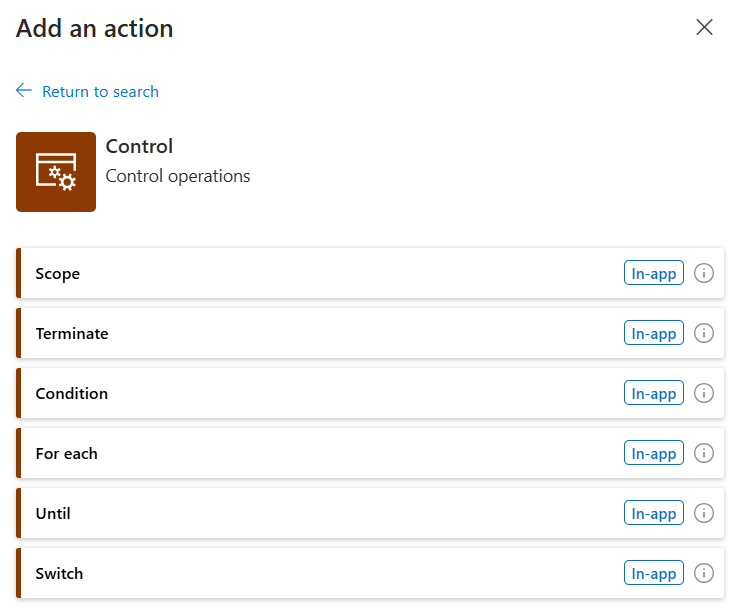

### Data Operations
ParseJSON, Join 등과 같이 데이터를 처리, 가공하기 위한 작업
데이터 가공하여 전체 워크플로를 단순화 가능

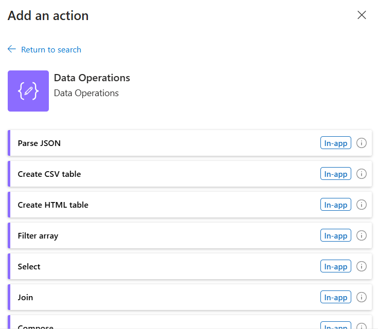

### Variables
변수설정과 관련된 작업으로 변수를 선언(initalize) 하거나 값 할당(Set variable), 값 변경(Increment, Append) 작업

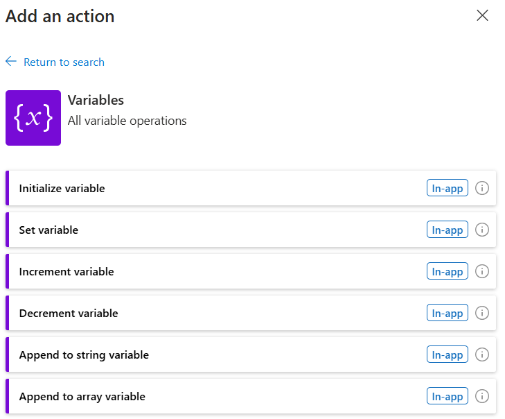

### Inline Code
자바스크립트 코드에 익숙한 경우 복잡한 로직을 단순화 하기 위해 인라인 자바스크립트 코드를 사용하여 워크를로 작성에 도움을 줌. 

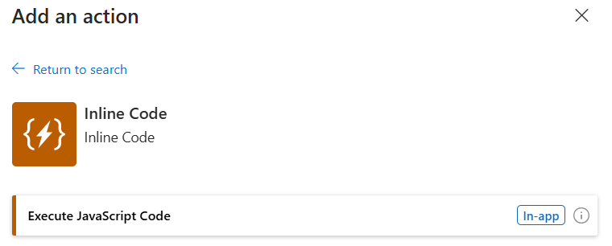
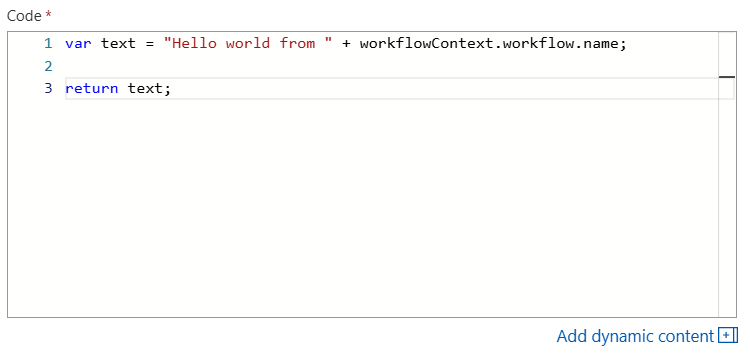

### Connectors
빌트인 커넥터 또는 사용자 정의 커넥터를 호출하여 필요한 작업을 실행
예시) 아웃룩을 통해 이메일 발송, Slack 의 특정 채널에 메시지 작성

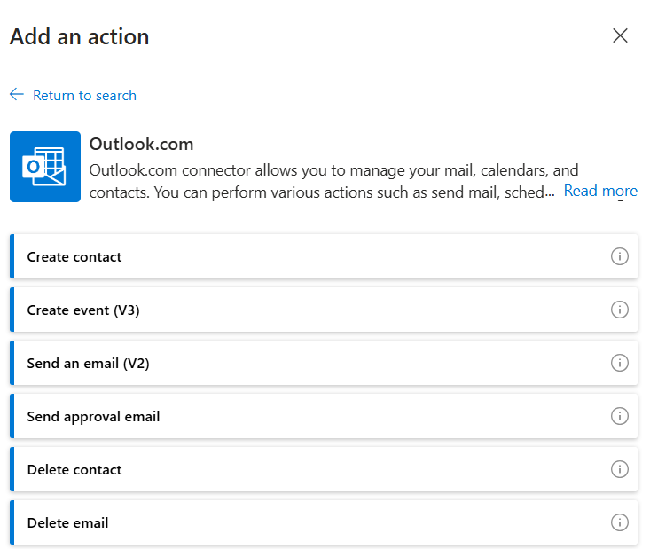

## 3. Configurations(설정)
테스트, 예외처리, 정책 적용 등 워크플로 수행에 필요한 각종 구성 설정

### Run After
변수, 제어문과 같이 특정 제어문이 수행되고 난 이후 예외가 발생되는지 확인 및 조건이 맞는 경우에만 다음 Action(작업)이 실행될 수 있도록 제어 장치(_작업에 마우스 우클릭 시 메뉴로 노출_)

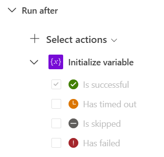

- Is successful: 이전 작업이 성공한 경우에만 다음 작업이 실행
- Has timed out: 이전 작업이 타임아웃된 경우에만 다음 작업이 실행
- Is skipped: 이전 작업이 스킵된 경우에만 다음 작업이 실행
- Failed: 이전 작업이 실패한 경우에만 다음 작업이 실행

### Testing
정적 결과로써 작업이 정상적으로 수행되는지 테스트 하기 위한 테스트 로직 (_테스트 로직이 활성화된 상태인 경우 작업의 우측하단에 비이커 모양의 아이콘이 활성화_)

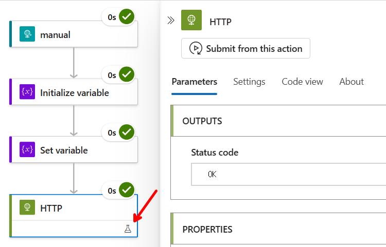

### Secure I/O
특정 작업이 보호되어야 할 값이 있는 경우 Security 의 Secure inputs, Secure outputs 을 활성화 하여 실행 결과을 숨길 수 있음. 
또한 구성 설정의 Workflow settings 메뉴에서 허용된 IP 만 접근 허용 설정을 통해 로직앱 접속 [제한](https://learn.microsoft.com/ko-kr/azure/logic-apps/logic-apps-securing-a-logic-app?tabs=azure-portal) 가능

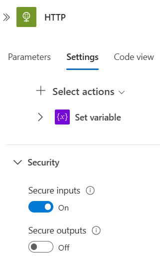


# 학습
- [Azure Logic Apps에서 통합 워크플로를 사용하여 비즈니스 프로세스 자동화](https://learn.microsoft.com/ko-kr/training/paths/build-workflows-with-logic-apps/)

# Hands-on

## Lab 0. (선택)Private 네트워크 환경에 Logic App 생성
[프라이빗 엔드포인트를 사용하여 프라이빗 스토리지 계정에 단일 테넌트 표준 논리 앱 배포](https://learn.microsoft.com/ko-kr/azure/logic-apps/deploy-single-tenant-logic-apps-private-storage-account#deploy-using-azure-portal-or-visual-studio-code) 문서에 설명된것과 같이 구성을 하거나, 다음 절차로 환경을 구성합니다.

1. 리소스 그룹 생성
    - 지역을 `Korea Central` 이나 가까운 지역으로 선택하여 리소스 그룹을 생성
    - 예시) rg-lga-lab
2. 가상 네트워크 생성
    - 생성된 리소스 그룹내에서 `virtual network` 생성
    - Basic
        - 이름: vnet-lga-lab
    - IP addresses (IP는 계획에 따라 조정 필요)
        - IP : 10.241.0.0/16
        - Subnets
            - sbn-lga-lab: 10.241.0.0/24, Subnet Delegation: Microsoft.Web/serverFarms
            - sbn-lga-storage: 10.241.1.0/24, Subnet Delegation: None

        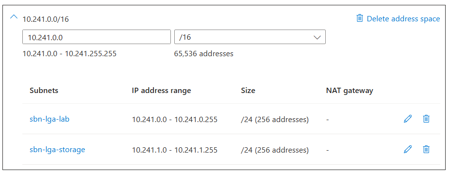

3. 스토리지 생성
    - Basic
        - 이름: stglgalab1104
    - Networking
        - Network access: Disable public access and use private access
        - Private endpoint 는 리소스 생성 이후 설정 예정
    - 리소스 생성
    - 리소스 생성완료 후 Security + networking 메뉴의 Private endpoint connections 에서 `+ Private endpoint` 선택
        - Blob 을 위한 PE 생성
            - Basic
                - 이름: pe-blob
            - Resource
                - Target sub-resource: blob
            - Networking
                - Virtual network: vnet-lga-lab
                - Subnet: sbn-lga-storage
            - DNS: 필요시 변경
        - File을 위한 PE 생성
            - Basic
                - 이름: pe-file
            - Resource
                - Target sub-resource: file
            - Networking
                - Virtual network: vnet-lga-lab
                - Subnet: sbn-lga-storage
            - DNS: 필요시 변경
        - Queue를 위한 PE 생성
            - Basic
                - 이름: pe-queue
            - Resource
                - Target sub-resource: queue
            - Networking
                - Virtual network: vnet-lga-lab
                - Subnet: sbn-lga-storage
            - DNS: 필요시 변경
        - Table을 위한 PE 생성
            - Basic
                - 이름: pe-table
            - Resource
                - Target sub-resource: table
            - Networking
                - Virtual network: vnet-lga-lab
                - Subnet: sbn-lga-storage
            - DNS: 필요시 변경
4. Logic App 생성
    - 호스팅 옵션: Standard, Workflow Service Plan
    - Basic
        - 이름: lga-lab-1104 (고유한 이름 지정 필요)
        - 지역: Korea Central
    - Storage
        - 저장소 계정: stglgalab1104 (이전 단계에서 생성한 storage account 이름)
    - Networking
        - Enable public access: `On`
        - Enable network injection: `On`
        - Virtual Network: `vnet-lga-lab`
        - Inbound access: `Off`
        - Outbound access: `On`
        - Outbound subnet: `sbn-lga-lab` (Vnet 생성시 구성한 subnet)
    - Monitoring
        - Enable Application Insights: `Yes`
    - 리소스 생성 후 Stop App

    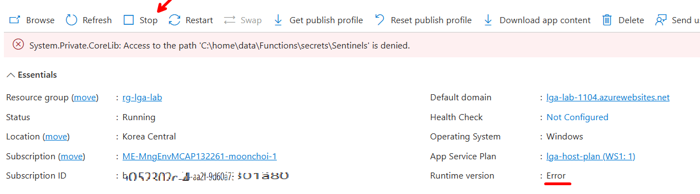

    - Settings - Environment variables 에 환경 변수 추가
        - 이름: WEBSITE_CONTENTOVERVNET
        - 값: 1

        - 이름: WEBSITE_VNET_ROUTE_ALL
        - 값: 1

        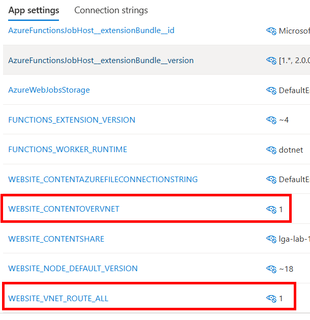

    - Logic App 시작 (개요 화면에서 `시작`), 약 3분 후에도 Runtime version 이 Error 인 경우 Restart 시도.

> [!NOTE]  
> Logic App 의 Inbound 트래픽을 Private Endpoint 로 구성하기 위해서는 다음 문서 참고 - [프라이빗 엔드포인트를 사용하여 표준 논리 앱과 Azure 가상 네트워크 간의 트래픽 보호](https://learn.microsoft.com/ko-kr/azure/logic-apps/secure-single-tenant-workflow-virtual-network-private-endpoint) 

 [](https://portal.azure.com/#create/Microsoft.Template/uri/https%3A%2F%2Fraw.githubusercontent.com%2Fdotnetpower%2Flogicapp%2Fmain%2Flogicapp-storage-private-endpoint-deploy.json)

## Lab 1. 기본 워크플로우 생성 및 트리거 설정

### 목표
- Azure Logic Apps에서 워크플로우를 만드는 방법 이해
- 트리거 설정 및 조건을 활용하여 다양한 이벤트 기반 워크플로우 설정

### 사전 준비 사항
- Azure 계정: Azure Portal에 로그인할 수 있어야 합니다.
- Azure 구독: Logic App을 만들기 위한 구독이 필요합니다.
- Azure Resource Group: 모든 리소스를 관리하기 위해 Resource Group을 생성해둡니다. 실습 일관성을 위해 리소스 그룹은 다음과 같은 이름 규칙으로 생성합니다. **rg-handson-lab00-alias**, 예시) rg-handson-lab01-moonchoi

> [!NOTE]  
> Consumption 타입으로 리소스를 생성하면 생성된 리소스가 하나의 워크플로이며, Standard 형태로 생성된 Logic App 은 각 워크플로를 생성한 후 워크플로를 생성한 후 진행 필요. Lab 의 리소스 이름은 workflow 이름으로 대체 가능.

### Lab 1.1: Logic App 만들기
1. Azure Portal에 로그인하고, Logic App 서비스를 검색하여 클릭합니다.
2. Logic App Designer에서 새 Logic App을 생성합니다. (Standard 로 생성한 경우 Workflow 생성으로 대체)
    - 리소스 이름: lga-lab01-<alias>
    - 리소스 그룹: 기존 리소스 그룹 선택 또는 새로 생성
    - 리전: KoreaCentral
3. 검토 후 생성을 클릭하여 Logic App 리소스를 배포합니다.

### Lab 1.2: 트리거 설정하기 (HTTP 요청 트리거)
1. Logic App이 배포되면 Logic App Designer를 엽니다.
2. 트리거 선택 단계에서 When a HTTP request is received를 검색하고 선택합니다.
3. 트리거 URL 생성: 이 트리거를 설정하면 자동으로 URL이 생성됩니다. 이 URL로 요청을 보내면 워크플로우가 실행됩니다.
    - 요청 본문 예시(use sample payload 를 선택하여 아래 코드 넣으면 스키마 생성)
    ```json
    {
    "name": "John Doe",
    "email": "johndoe@example.com"
    }
    ```
4. `저장`을 눌럭 트리거 설정을 완료합니다.

### Lab 1.3: 조건 추가하여 메시지 생성하기
1. 트리거 아래에 새로운 단계 추가를 클릭합니다.
2. 동작 선택에서 Outlook을 선택하여 이메일을 발송하거나 Slack 또는 Teams와 통합하여 메시지를 보냅니다.
3. 조건 설정:

    - HTTP 요청에서 name이 빈 값이 아닌지 확인하는 조건을 추가합니다.
    - 조건에서 If를 사용하여 조건을 설정합니다.
        - 예: "name" 필드가 "John Doe"일 때 메시지 발송
        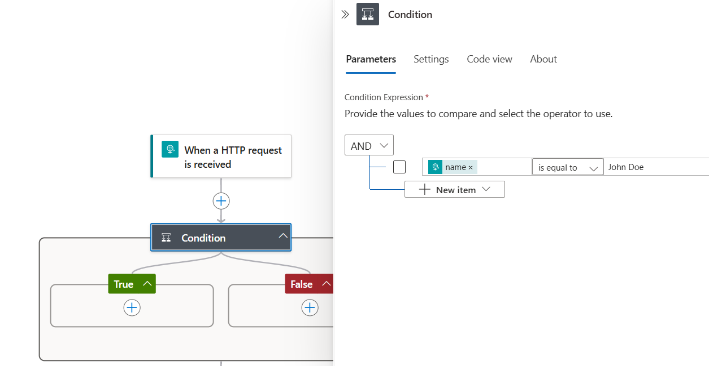
4. 메시지 내용 작성:

    - 예시로 "Hello, {name}! Your email is {email}"과 같은 메시지를 작성합니다.
    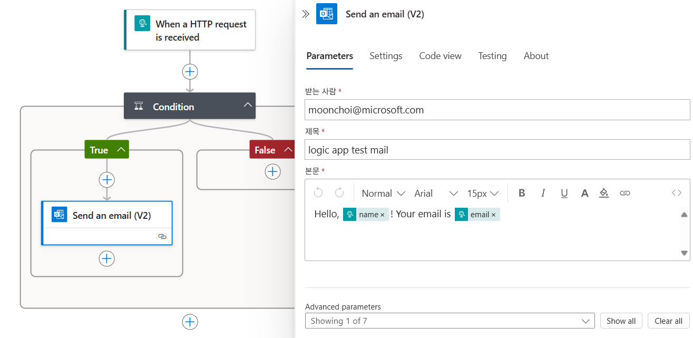

5. `저장` 후 `개요` 화면으로 이동시 생성된 workflow URL을 확인 가능합니다.

### Lab 1.4: 워크플로우 실행 및 테스트
1. 테스트: 생성된 트리거 URL을 복사합니다.
2. HTTP 요청 보내기:
3. Postman이나 CURL을 사용하여 URL로 JSON 형식의 POST 요청을 보냅니다.
    - 예:
    ```bash
    curl -X POST "<trigger URL>" -H "Content-Type: application/json" -d "{\"name\": \"John Doe\", \"email\": \"johndoe@example.com\"}"

    ```

    - 결과 예시

    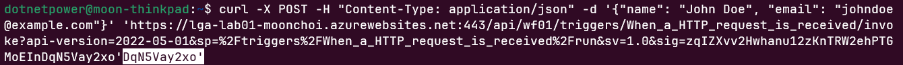

    - 수신된 이메일

    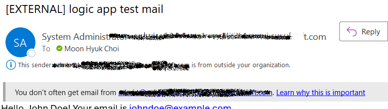

4. 결과 확인: Logic Apps의 실행 상태를 확인하여 조건에 맞는 메시지가 전송되었는지 확인합니다.
    - Standard 인 경우 `Log stream` 을 활성화 하여 호출자의 요청을 실시간으로 모니터링 (Consumption 에서는 지원 x)

    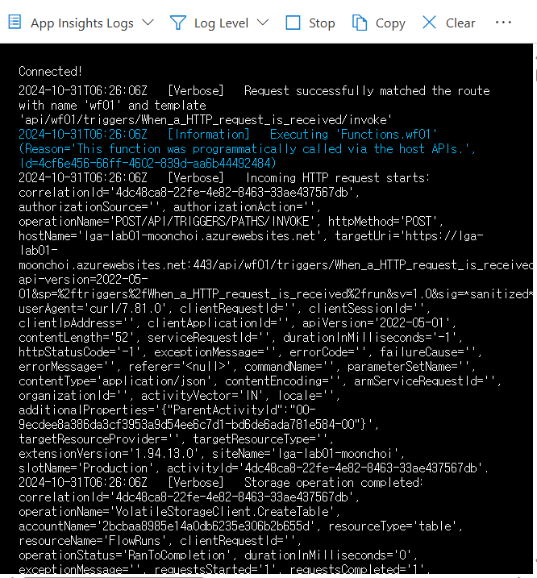

### Lab 1.5: 결과 정리
- HTTP 트리거를 사용해 워크플로우를 시작하는 방법 확인
- 조건 설정을 통해 특정 조건에 대한 흐름 이해
- 상태 로그를 통해 실시간 요청 확인


## Lab 2. 조건과 분기 흐름 설정
이 실습에서는 Azure Logic Apps에서 조건문을 사용하여 분기 처리를 하는 방법을 학습합니다. 이 기능을 통해 Logic App 워크플로우 내에서 다양한 상황에 따라 다른 작업을 수행할 수 있습니다.

### 목표
- Logic Apps 에서 조건문 설정 방법 이해
- 조건에 따라 다른 경로로 분기 처리하는 방법 학습

### 사전 준비 사항
- Lab 1 과 동일

### Lab 2.1: Logic App 생성하기
1. Azure Portal에 로그인하고, Logic App 서비스를 검색하여 클릭합니다.
2. Logic App Designer에서 새 Logic App을 생성합니다.
    - 리소스 이름: lga-lab02-<alias>
    - 리소스 그룹: 기존 리소스 그룹 선택 또는 새로 생성 (예시: rg-handson-lab02-moonchoi)
    - 리전: KoreaCentral
3. 검토 후 생성을 클릭하여 Logic App 리소스를 배포합니다.

### Lab 2.2: 트리거 설정 (HTTP 요청 트리거)
1. Logic App이 배포되면 Logic App Designer를 엽니다.
2. 트리거 선택 단계에서 When a HTTP request is received 트리거를 검색하고 선택합니다.
3. 트리거 URL 생성: 이 트리거를 설정하면 자동으로 URL이 생성됩니다.
    - 요청 본문 (Request Body) 예시:
    ```json
    {
    "username": "JaneDoe",
    "orderAmount": 150
    }

    ```
4. 저장을 눌러 트리거 설정을 완료합니다.

### Lab 2.3: 조건 설정하기
1. 트리거 아래에 새로운 단계 추가를 클릭하고, 조건 (Condition) 작업을 검색하여 추가합니다.
2. 조건 설정:
    - 조건문을 구성하여 "orderAmount"가 100보다 큰 경우와 작은 경우로 분기합니다.
    - 조건 값 설정:
        - orderAmount > 100
    - 이 조건이 **참(True)** 일 때와 **거짓(False)** 일 때의 분기 흐름을 설정할 수 있습니다.

### Lab 2.4: 조건 분기에 따른 분기 작업 설정
조건이 참 (True) 인 경우
1. If Yes 경로에서, Outlook 또는 Email을 선택하여 이메일 발송 작업을 추가합니다.
2. 메일 내용 작성:
    - 수신자: admin@example.com
    - 제목: "주문 승인: {username}"
    - 본문: "주문 금액이 $100 이상입니다. 주문 승인을 진행합니다."
조건이 거짓 (False) 인 경우
1. If No 경로에서, Slack 또는 Microsoft Teams에 메시지를 보내도록 작업을 추가합니다.
2. 메시지 내용 작성:
    - 채널: 알림을 보낼 Slack 또는 Teams 채널 선택
    - 메시지 내용: "{username}님의 주문 금액이 $100 이하입니다. 검토가 필요합니다."

### Lab 2.5: 테스트 및 실행 확인
1. 테스트: 생성된 트리거 URL을 복사합니다.
2. HTTP 요청 보내기:
3. Postman이나 CURL을 사용하여 JSON 형식의 POST 요청을 URL로 보냅니다.
    - 예:
    ```bash
    curl -X POST "<trigger URL>" -H "Content-Type: application/json" -d "{\"username\": \"JaneDoe\", \"orderAmount\": 150}"
    ```
4. 결과 확인: 조건에 따라 설정된 이메일이나 메시지가 전송되었는지 Logic Apps의 실행 기록을 통해 확인합니다.

### Lab 2.6: 결과 정리
- HTTP 요청을 통해 트리거된 Logic App 에서 조건문을 설정하여 분기 처리 하는 방법 확인
- 조건에 따라 다른 커넥터(Outlook, Teams)가 수행되는 것 확인


## Lab 3. Azure Blob Storage 통합
이 실습에서는 Azure Logic Apps를 사용하여 Azure Blob Storage와 통합하여 파일을 업로드하고 해당 파일에 대해 특정 작업을 수행하는 방법을 학습합니다. 이를 통해 Logic Apps에서 파일 관리 자동화 프로세스를 구축할 수 있습니다.

### 목표
- Azure Blob Storage와 Logic Apps를 통합하는 방법 이해
- Blob 파일이 업로드될 때 Logic Apps를 트리거하여 자동으로 워크플로우 실행

### 사전 준비 사항
- Lab 1 의 준비사항 + Blob Storage

### Lab 3.1: Blob Storage 설정
1. Azure Portal에서 Storage account를 검색하고 선택하여 새 저장소 계정을 생성합니다.
    - 이름: sta-lab03-<alias> (유일한 이름 필요)
    - 리소스 그룹: 기존 리소스 그룹 선택 또는 새로 생성
    - 위치: KoreaCentral
2. 저장소 계정이 만들어지면, Containers로 이동하여 새 컨테이너를 생성합니다.
    - 컨테이너 이름: mycontainer
    - 공개 액세스 수준: **비공개(Private)** 로 설정
3. 컨테이너가 생성되었으면 준비가 완료됩니다.

### Lab 3.2: Logic App 생성 및 Blob Storage 트리거 설정
1. Azure Portal에서 Logic App을 검색하여 클릭하고 새 Logic App을 만듭니다.
    - 리소스 이름: lga-lab03-<alias>
    - 리소스 그룹: 기존 리소스 그룹 선택 또는 새로 생성 (예시: rg-handson-lab03-moonchoi)
2. Logic App이 생성되면 Logic App Designer를 엽니다.
3. 트리거 선택: 트리거 단계에서 When a blob is added or updated 트리거를 검색하고 선택합니다.
4. 트리거 설정:
    - Storage Account 연결: 앞서 생성한 Blob Storage 계정을 연결합니다.
    - Blob Path: mycontainer 컨테이너를 입력합니다.

    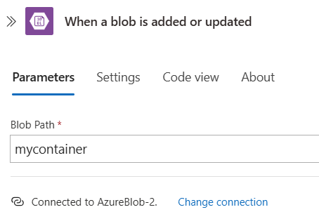
    
5. 저장을 눌러 트리거 설정을 완료합니다.

### Lab 3.3: 파일 처리 워크플로우 설정
1. 트리거 아래에 단계 추가를 클릭하고, 이메일 발송 또는 Microsoft Teams로 알림 보내기 작업을 추가합니다.
    - Outlook이나 Gmail을 사용하여 파일 업로드 시 이메일 알림을 설정합니다.
    - 이메일 제목: "새 파일이 업로드되었습니다: {파일 이름}"
    - 이메일 본문: "{파일 이름} 파일이 업로드되었습니다. 확인이 필요합니다."

    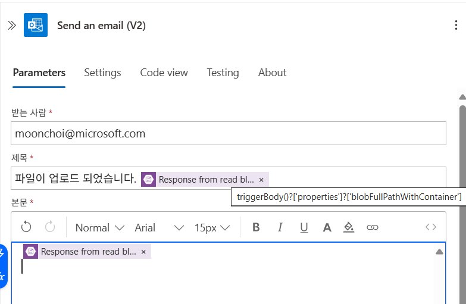

2. 파일 메타데이터 가져오기: 필요한 경우 Get file metadata 작업을 추가하여 업로드된 파일의 크기, 유형 등 메타데이터를 추가로 가져올 수 있습니다.
3. 조건부 흐름 설정 (선택 사항):
    - 예를 들어, 파일 크기에 따라 추가적인 알림이나 다른 경로로 분기하도록 설정할 수 있습니다.
    - Condition 작업을 추가하여 파일 크기가 1MB 이상인 경우 특정 알림을 보내도록 설정해 보세요.

### Lab 3.4: 테스트 및 실행 확인
1. 생성한 Storage Account 의 Blob 에 생성한 mycontainer 아래에 파일을 업로드 합니다. (private endpoint 환경인 경우 jumpbox 등으로 접속하여 파일 전송 필요)
2. Logic App 이 해당 컨테이너에 파일 변경을 감지하여 워크플로우가 실행됩니다.
3. 결과 확인
    - 설정한 이메일 또는 Teams 채널로 알림이 전송이 되었는지 확인 합니다.
    - Log Stream 을 활성화 하고 파일이 업로드 될때 어떤 로그가 기록되는지 확인 합니다.

### Lab 3.5: 결과 정리
- Azure Blob Storage와 Logic Apps를 통합하여 파일 업로드 시 자동으로 알림을 보내는 기본적인 워크플로우를 만들었습니다.
- 업로드된 파일의 메타데이터를 조건에 따라 처리하는 방법을 배웠습니다.
- Logic App의 상태와 로그를 통해 각 작업이 제대로 수행되었는지 확인했습니다.

### (선택사항)추가 학습 가능한 시나리오
- 파일 내용 분석: OCR, 컴퓨터 비전 API 를 호출하여 이미지에서 글자나 의미를 추출해 봅니다.
- 파일 아카이브: 특정 조건을 만족하는 파일을 다른 스토리지로 이동시키거나 삭제 하는 워크플로우 추가

## Lab 4. VM의 High CPU 감지 및 알림
이 실습에서는 Azure Logic Apps와 Azure Monitor를 사용하여 특정 가상 머신(VM)의 CPU 사용률이 높은 경우 자동으로 감지하고 알림을 보내는 방법을 학습합니다. 이를 통해 고성능 작업이나 이상 징후를 실시간으로 감시하고 즉각적인 조치를 취할 수 있습니다.

### 목표
- Azure Monitor에서 특정 VM의 CPU 사용량을 모니터링하는 경고(알림) 규칙 만들기
- CPU 사용량이 높은 경우 Logic Apps를 통해 이메일, Teams 또는 SMS로 알림 보내기

### 사전 준비 사항
- Azure 계정: Azure Portal에 로그인할 수 있어야 합니다.
- Azure 구독: Logic App과 Monitor 경고 규칙을 만들기 위한 구독이 필요합니다.
- Azure Virtual Machine (VM): 모니터링할 VM이 생성되어 있어야 합니다.
- Azure Monitor 및 Log Analytics Workspace: 모니터링 데이터를 수집하기 위해 설정합니다.

### Lab 4.1: Log Analytics Workspace 생성
1. Azure Portal에서 Log Analytics workspaces를 검색하고 선택하여 새 Log Analytics Workspace를 생성합니다.
    - 이름: law-lab04
    - 리소스 그룹: 기존 리소스 그룹 선택 또는 새로 생성
2. 생성된 Log Analytics Workspace로 이동하여, 모니터링할 VM을 이 워크스페이스에 연결합니다.
    - VM 설정에서 Diagnostics settings > Enable을 통해 Log Analytics Workspace와 연결할 수 있습니다.

### Lab 4.2: Metric Alert 설정 (CPU 사용률 경고)
1. Azure Portal에서 Monitor 서비스로 이동하여 Alerts를 선택합니다.
2. + New alert rule을 클릭하여 새 경고 규칙을 만듭니다.
3. Scope: 경고를 적용할 대상 VM을 선택합니다.
4. Condition 설정:
    - Signal Type: Metrics 선택
    - Metric: Percentage CPU를 선택합니다.
    - Threshold: 예를 들어, CPU 사용률이 80% 이상일 때 경고가 발생하도록 설정
    - Aggregation type: 평균(Average)을 선택하여 평균 CPU 사용률을 기준으로 경고가 발생하도록 설정
5. Action Group 생성:
    - Create action group을 클릭하여 알림을 받을 방법을 설정합니다.
    - (**이 단계를 실행하기 전에 Lab 4.3 이 선행되어야 합니다.**)Action Type으로 Logic App을 선택하고, 이 경고를 트리거할 Logic App을 연결합니다.

### Lab 4.3: Logic App 생성 및 CPU 경고 알림 설정
1. Azure Portal에서 Logic App을 검색하여 클릭하고 새 Logic App을 만듭니다.
    - 이름: HighCpuAlertWorkflow
    - 리소스 그룹: 기존 리소스 그룹 선택 또는 새로 생성
2. Logic App이 생성되면 Logic App Designer를 엽니다.
3. 트리거 선택: Logic App Designer에서 When an HTTP request is received 트리거를 추가합니다.
    - 트리거는 Metric Alert의 Action Group에 연결되어, 경고가 발생할 때 Logic App이 호출됩니다.
    - 다음 예제 payload 를 복사하여, 예제 payload 를 사용하여 스키마 생성 버튼을 클릭 후 붙여넣습니다.
    - 예제 [Payload](https://learn.microsoft.com/ko-kr/azure/azure-monitor/alerts/alerts-common-schema)
    ```json
    {
    "schemaId": "azureMonitorCommonAlertSchema",
    "data": {
        "essentials": {
        "alertId": "/subscriptions/<subscription ID>/providers/Microsoft.AlertsManagement/alerts/aaaa0a0a-bb1b-cc2c-dd3d-eeeeee4e4e4e",
        "alertRule": "WCUS-R2-Gen2",
        "severity": "Sev3",
        "signalType": "Metric",
        "monitorCondition": "Resolved",
        "monitoringService": "Platform",
        "alertTargetIDs": [
            "/subscriptions/<subscription ID>/resourcegroups/pipelinealertrg/providers/microsoft.compute/virtualmachines/wcus-r2-gen2"
        ],
        "configurationItems": [
            "wcus-r2-gen2"
        ],
        "originAlertId": "3f2d4487-b0fc-4125-8bd5-7ad17384221e_PipeLineAlertRG_microsoft.insights_metricAlerts_WCUS-R2-Gen2_-117781227",
        "firedDateTime": "2019-03-22T13:58:24.3713213Z",
        "resolvedDateTime": "2019-03-22T14:03:16.2246313Z",
        "description": "",
        "essentialsVersion": "1.0",
        "alertContextVersion": "1.0"
        },
        "alertContext": {
        "properties": null,
        "conditionType": "SingleResourceMultipleMetricCriteria",
        "condition": {
            "windowSize": "PT5M",
            "allOf": [
            {
                "metricName": "Percentage CPU",
                "metricNamespace": "Microsoft.Compute/virtualMachines",
                "operator": "GreaterThan",
                "threshold": "25",
                "timeAggregation": "Average",
                "dimensions": [
                {
                    "name": "ResourceId",
                    "value": "3efad9dc-3d50-4eac-9c87-8b3fd6f97e4e"
                }
                ],
                "metricValue": 7.727
            }
            ]
        }
        },
        "customProperties": {
        "Key1": "Value1",
        "Key2": "Value2"
        }
    }
    }
    ```
4. 이메일 알림 또는 Teams 메시지 작업 추가:
    - HTTP 요청을 트리거로 받으면 이메일 또는 Teams 메시지를 보내는 작업을 추가합니다.
    - 메일 내용 설정:
        - 제목: "High CPU Usage Alert on VM {VM 이름}"
        - 본문: "CPU 사용률이 80%를 초과했습니다. 현재 CPU 사용률: {Percentage CPU}%. 조치가 필요합니다."
5. 저장을 눌러 Logic App을 설정합니다.

### Lab 4.4: 테스트 및 실행 확인
1. VM 부하 시뮬레이션: 모니터링 중인 VM에서 CPU 사용률을 인위적으로 높여서 경고가 발생하도록 합니다.
    - 예: VM에 로그인하여 CPU 부하를 높이는 스크립트를 실행합니다.
    ```bash
    # Windows
    # while ($true) { }

    # Linux
    yes > /dev/null &
    ```
2. 경고 트리거 확인: Azure Monitor에서 경고 규칙이 트리거되는 것을 확인하고 Logic App이 실행되었는지 확인합니다.
3. 알림 확인: 설정된 이메일이나 Teams 채널로 경고 메시지가 전송되었는지 확인합니다.

### Lab 4.5: 결과 정리
- Azure Monitor를 통해 VM의 CPU 사용량을 모니터링하는 Metric Alert를 설정했습니다.
- Logic App을 경고 액션으로 연결하여, CPU 사용량이 높을 때 이메일이나 Teams로 자동 알림을 받는 워크플로우를 구성했습니다.
- Azure Monitor 및 Logic App의 로그를 통해 CPU 경고가 발생하고 알림이 전송되는 과정을 확인했습니다.

